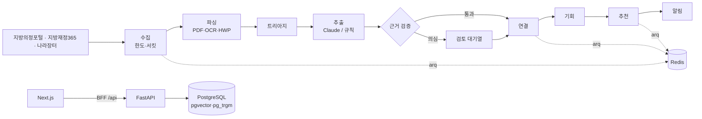

# 발주 예측

**입찰공고가 뜨기 전에, 공공 수요를 먼저 읽는 B2G 영업 인텔리전스**

[](https://github.com/sokldjs554/mulmit/actions/workflows/ci.yml)
[](LICENSE)

지자체 사업은 입찰공고 6~18개월 전에 **지방의회 회의록**("내년도 본예산에 반영하겠습니다")과 **세출예산서 세부사업**으로 먼저 모습을 드러냅니다. 발주 예측은 이 문서들을 매일 읽어 수요 신호를 뽑고, 원문 근거를 검증한 뒤, 발주계획 → 사전규격 → 입찰공고로 이어지는 하나의 **기회**로 묶어 공급 기업에 추천합니다.


<sub>화면과 수치는 모두 합성 데모 데이터입니다(아래 [평가](#평가) 참고).</sub>

---

## 목차
- [왜 이 주제인가](#왜-이-주제인가)
- [무엇을 하나](#무엇을-하나)
- [채용 공고의 기술이 쓰인 곳](#채용-공고의-기술이-쓰인-곳)
- [아키텍처](#아키텍처)
- [평가](#평가)
- [화면](#화면)
- [실행하기](#실행하기)
- [저장소 구조](#저장소-구조)
- [한계와 다음 단계](#한계와-다음-단계)

## 왜 이 주제인가

시작 전에 국내·해외의 비슷한 서비스를 조사했습니다([전체 조사 문서](docs/research/market-landscape.md)).

| | 대표 사례 | 가장 이른 신호 |
|---|---|---|
| 국내 · 정부지원사업 매칭 | 지원매치, 지원금AI, K-Fund, 커넥트웍스 | 지원사업 공고 |
| 국내 · 나라장터 공고 분석 | 클라이원트, 낙비, 디마툴즈, 일타비드, 다수의 GitHub 프로젝트 | 발주계획·사전규격·입찰공고 |
| 국내 · 회의록 AI | 개혁연구원 회의록 DB, 충남도의회 AI 검색 | 회의록 (정책·의정 용도, 영업용 아님) |
| **해외 · 공고 이전 신호** | [Starbridge](https://starbridge.ai/features/buying-signals-monitor), [GovSpend Meeting Intelligence](https://govspend.com/meeting-intelligence/), [Hamlet](https://www.myhamlet.com/about) | **회의록·예산 문서 (RFP 6~18개월 전)** |

- 지원사업 매칭과 공고 검색은 국내에서 이미 포화 상태이고, 같은 공공 API로 만든 포트폴리오도 많습니다.
- 미국에서는 "공고 이전 신호"가 독립된 제품 범주로 투자를 받고 있지만, 국내 공공조달에는 이 층이 없습니다.
- 데이터는 열려 있습니다: 국회도서관 지방의정포털 Open API(회의록), 지방재정365(예산서), 조달청 발주계획·사전규격·입찰공고·계약과정통합공개 API.

## 무엇을 하나

```
의회 발언 ──► 예산 편성 ──► 발주계획 ──► 사전규격 ──► 입찰공고
 6~18개월      3~12개월      1~6개월       2~8주         D-day
 회의록         세출예산서     나라장터       나라장터       나라장터
 (HTML)        (PDF·스캔·HWP) (API)         (API)         (API)
```

1. **수집**: 다섯 개 공공 소스를 한도·장애를 견디며 증분 수집합니다.
2. **파싱**: 스캔 PDF는 페이지 단위 OCR, HWP/HWPX는 직접 파싱, 회의록은 질문–답변 교환 단위로 자릅니다.
3. **추출**: Claude 구조화 출력으로 사업명·금액·연도·발언 강도(확약/계획/검토/어렵다)·근거 문장을 뽑습니다. 키가 없거나 예산을 넘으면 규칙 기반 추출기가 대신합니다.
4. **근거 검증**: 인용 문장이 원문에 있는지, 금액·연도가 원문과 맞는지 코드로 다시 확인합니다. 틀리면 버리거나 운영자 검토로 보냅니다.
5. **연결**: 서로 다른 이름("스쿨존 카메라" ↔ "어린이보호구역 지능형 CCTV" ↔ "스쿨존 AI 안전카메라 설치사업")을 같은 사업으로 묶습니다.
6. **추천·알림**: 회사 프로필 적합도에 공고 전환 가능성과 영업 가능한 선행 기간을 더해 순위를 매기고, 이메일·Slack·카카오 알림톡으로 알립니다.
7. **과금**: 월 구독(토스페이먼츠 자동결제) + 크레딧(Deep Brief 1회 3크레딧).

## 채용 공고의 기술이 쓰인 곳

| 공고 항목 | 이 저장소에서 | 위치 |
|---|---|---|
| FastAPI 비동기 API | 앱 팩토리, async SQLAlchemy, 키셋 페이지네이션, 요청 ID·구조화 로그, 과금 API의 `Idempotency-Key` | [`api/`](apps/api/src/mulmit/api) |
| Redis 큐·cron 배치 | arq 워커 + KST cron, 작업 ID 중복 제거, 한도 초과·서킷·일시 오류별 재시도, 모든 실행 `job_runs` 기록 | [`worker/`](apps/api/src/mulmit/worker), [ADR-0003](docs/adr/0003-arq-and-in-worker-cron.md) |
| PostgreSQL 스키마·마이그레이션·쿼리 튜닝 | Alembic(비동기), 24개 테이블, pgvector HNSW, pg_trgm GIN, 부분 인덱스, `FOR UPDATE SKIP LOCKED`, CHECK 제약 | [`migrations/`](apps/api/migrations), [ADR-0004](docs/adr/0004-postgres-only-search.md) |
| Next.js/TypeScript 사용자 웹·어드민 | App Router 고객 앱 + 운영 콘솔, OpenAPI 생성 타입, TanStack Query, BFF 프록시, SVG 차트 | [`apps/web`](apps/web), [ADR-0008](docs/adr/0008-bff-and-typed-client.md) |
| LLM 파이프라인 (프롬프트·구조화 출력·검증·품질 평가·비용 최적화) | structured outputs, 프롬프트 캐싱, effort 조절, 서버 측 fallback, 근거 검증기, 트리아지, 콘텐츠 해시 캐시, 일일 예산 가드, 평가 러너 | [`llm/`](apps/api/src/mulmit/llm), [`domain/grounding.py`](apps/api/src/mulmit/domain/grounding.py), [ADR-0002](docs/adr/0002-grounded-extraction.md), [ADR-0006](docs/adr/0006-one-model-low-effort.md) |
| 비정형 문서 파싱·OCR | PDF 페이지별 텍스트층 판정 → tesseract `kor+eng` OCR + 후보정, HWP5 레코드 파서, HWPX | [`parsing/`](apps/api/src/mulmit/parsing) |
| 대규모 데이터 수집·정규화 | 토큰 버킷 + KST 일일 한도(Redis Lua), 서킷 브레이커, HTTP 200 오류 본문 분류, 한국어 금액·기관·시점 정규화 | [`sources/`](apps/api/src/mulmit/sources), [`domain/`](apps/api/src/mulmit/domain), [데이터 소스](docs/data-sources.md) |
| 검색·추천·랭킹 | 임베딩 + 규칙 결합 연결, 특징별 가중 랭킹과 설명, 백테스트로 전환율 보정, 사용자 피드백 | [`pipeline/`](apps/api/src/mulmit/pipeline) |
| 멀티채널 알림 | 이메일(Jinja2)·Slack 웹훅·카카오 알림톡(Solapi HMAC), 중복 방지, 방해 금지 시간, 영구 오류 시 채널 비활성화 | [`notify/`](apps/api/src/mulmit/notify) |
| 구독·크레딧 결제 | 토스 빌링키(Fernet 암호화), 멱등 결제·웹훅 대사, 추가 전용 크레딧 원장, 1·3·7일 재시도 | [`billing/`](apps/api/src/mulmit/billing), [ADR-0005](docs/adr/0005-credit-ledger.md) |
| 클라우드 컨테이너 배포·로깅·에러 트래킹 | Docker, Cloud Run(API 내부 전용·워커 상시), Cloud SQL, Memorystore, Secret Manager, WIF 배포, structlog JSON, Sentry | [`infra/terraform`](infra/terraform), [배포 워크플로](.github/workflows/deploy.yml) |
| 의사결정 문서화 | ADR 8건, 아키텍처·런북·데이터 소스·평가 문서 | [`docs/`](docs) |
| 테스트·정적 타입 | pytest 122개(실제 PostgreSQL·Redis 통합 테스트 포함), vitest 13개, mypy strict, TypeScript strict | [`apps/api/tests`](apps/api/tests) |
| Git 브랜치 전략·코드 리뷰 | 짧은 브랜치 + 트렁크, Conventional Commits, PR 템플릿, CODEOWNERS | [CONTRIBUTING](CONTRIBUTING.md) |
| AI 코딩 에이전트 활용 | 에이전트 지침(`AGENTS.md`), 평가 수치로 끝나는 작업 루프, 사람이 확인할 항목 명시 | [AI 워크플로](docs/ai-workflow.md) |
| 대용량 공공 데이터 | 국회도서관 지방의정포털, 조달청 나라장터 3종, 지방재정365 | [데이터 소스](docs/data-sources.md) |

## 아키텍처



자세한 흐름·도메인 모델·규칙은 [docs/architecture.md](docs/architecture.md), 결정 배경은 [ADR](docs/adr/README.md).

## 평가

정답을 심은 **합성 세계**(시드 7, 기준일 2026-09-25, 규모 1.0; 21개 사업 원형, 동명 기관, 스캔 예산서, 약한 발언, 공고로 이어지지 않는 사업, 무관한 공고 포함)와 생성기 밖의 **수기 세트**, 그리고 **백테스트**로 측정합니다. 추출은 이 저장소 기본값인 **규칙 기반 추출기**로 측정했습니다. CI는 합성 세계 지표에 품질 게이트를 겁니다.

| 영역 | 지표 | 값 |
|---|---|---|
| 추출 (합성) | 정밀도 / 재현율 | 100% / 100% (정답 106건) |
| | 필드 정확도: 금액·연도·발언 강도·기관 / 분야 | 100% / 97.2% |
| 트리아지 | LLM 없이 건너뛴 청크 / 그 상태의 정답 재현율 | 59.4% / 99.1% |
| 연결 | 쌍 정밀도 / 재현율 | 100% / 100% |
| OCR (스캔 예산서) | 문자 오류율 원본 → 보정 / 금액 토큰 정확도 | 1.13% → 0.99% / 100% |
| **수기 세트** | 정밀도 / 재현율 (규칙 기반) | **88.9% / 61.5%** |
| 백테스트 | 공고 이전에 공개 신호가 있던 입찰 | 48건 중 75% |
| | 첫 공개 신호 → 입찰공고 선행 기간 중앙값 | 308일 |
| | 의회 발언 강도별 입찰 전환율: 확약 / 검토 | 88.2% / 20.0% |

- 합성 세계 점수는 **파이프라인이 설계대로 동작한다는 증거일 뿐 실제 정확도가 아닙니다.** 같은 사람이 만든 생성기와 추출기는 같은 가정을 공유합니다. 수기 세트의 재현율 61.5%가 규칙 기반 추출기의 실제 한계에 더 가깝고, LLM 경로가 메워야 할 간격입니다.
- 전체 리포트: [docs/evaluation.md](docs/evaluation.md) (`make eval`로 재생성).

## 화면

| 기회 피드 | 운영 개요 |
|---|---|
|  |  |
| **검토 대기열** — 동명 기관("중구청")을 추측하지 않고 사람에게 넘김 | **평가·백테스트** |
|  |  |
| **요금·크레딧** — 구독, 크레딧 원장, 결제 내역 | **다크 모드** |
|  |  |

그 밖에: [랜딩](docs/screenshots/landing.png) · [회사 프로필](docs/screenshots/profile.png) · [알림 설정](docs/screenshots/alerts.png) · [수집원](docs/screenshots/admin-sources.png) · [작업 로그](docs/screenshots/admin-jobs.png) · [LLM 비용](docs/screenshots/admin-llm.png) · [모바일](docs/screenshots/feed-mobile.png)

<sub>스크린샷은 사례가 더 많은 `mulmit seed --scale 1.5` 데모 세계에서 찍었습니다.</sub>

## 실행하기

### Docker로 전체 스택

```bash
cp .env.example .env            # 비워 둬도 오프라인 데모가 동작합니다
docker compose up -d --build    # 웹 :3000, API :8000/docs, 메일 확인 :8025
docker compose run --rm api mulmit seed --anchor 2026-09-25
docker compose run --rm api mulmit demo run
```

### 로컬 개발

필요: Python 3.11 + [uv](https://docs.astral.sh/uv/), Node 22 + pnpm, Docker(데이터베이스용), tesseract-ocr + `kor` 언어팩(스캔 PDF 데모용).

```bash
make install        # uv sync + pnpm install
make infra          # PostgreSQL(pgvector)·Redis·Mailpit
make demo           # 마이그레이션 → 합성 세계 시드 → 전체 파이프라인 (약 20초)
make api            # :8000   (다른 터미널)
make worker         # arq 워커 + cron
make web            # :3000
make lint test eval
```

### 데모 계정

| 계정 | 비밀번호 | 역할 |
|---|---|---|
| `demo@mulmit.dev` | `mulmit-demo-1234` | Pro 플랜, 스마트쉘터·스마트폴·지능형 CCTV 기업 |
| `care@mulmit.dev` | `mulmit-demo-1234` | 무료 플랜, AI 돌봄 스피커 스타트업 |
| `admin@mulmit.dev` | `mulmit-admin-1234` | 운영 콘솔(`/admin`) |

### 실제 키로 켜기

`.env`에 넣으면 해당 부분만 실제 서비스로 바뀝니다: `MULMIT_ANTHROPIC_API_KEY` + `MULMIT_LLM_PROVIDER=anthropic`, `MULMIT_VOYAGE_API_KEY`, `MULMIT_CLIK_API_KEY`, `MULMIT_DATA_GO_KR_SERVICE_KEY`, `MULMIT_LOFIN_API_KEY`, 토스(`MULMIT_PAYMENT_PROVIDER=toss`), Solapi. 전체 목록은 [.env.example](.env.example).

## 저장소 구조

```
apps/api/             FastAPI · arq 워커 · 파이프라인 (Python 3.11, uv)
  src/mulmit/
    sources/          공공 API 어댑터, 한도·서킷·재시도
    parsing/          PDF 텍스트층, OCR(+후보정), HWP5/HWPX, 청크
    llm/              Claude 제공자, 규칙 기반 추출기, 캐시·예산 가드
    domain/           금액·기관·시점 정규화, 근거 검증, 분류, 동의어
    pipeline/         수집 → 처리 → 연결 → 추천 → 브리프, 백테스트
    billing/ notify/  토스 자동결제·크레딧 원장 / 이메일·Slack·알림톡
    api/ worker/      HTTP 라우터 / arq 작업·cron
    demo/ eval/       합성 세계 / 평가 러너·수기 세트
  migrations/ tests/
apps/web/             Next.js 16 고객 앱 + 운영 콘솔
infra/terraform/      GCP 서울 리전 (Cloud Run, Cloud SQL, Memorystore, …)
docs/                 조사, ADR, 아키텍처, 평가, 데이터 소스, 런북, 스크린샷
```

## 한계와 다음 단계

솔직하게 적습니다.

- **실제 공공 API는 호출해 보지 못했습니다.** 개발 환경의 네트워크 정책으로 `clik.nanet.go.kr`·`data.go.kr`·`lofin.mois.go.kr`에 접속할 수 없어, 경로·필드는 공개 명세와 공개 저장소를 근거로 작성하고 계약 픽스처로만 검증했습니다. 설정(`sources.config`)으로 코드 수정 없이 고칠 수 있게 해 두었습니다.
- **Claude 경로의 품질은 아직 측정 전입니다.** 요청 형태·오류 매핑·폴백은 테스트했지만, 실제 API로 수기 세트를 돌린 수치는 없습니다. 다음 단계는 같은 평가 러너로 규칙 기반 대비 개선을 재는 것입니다.
- **인프라는 검증까지만 했습니다.** Terraform은 `validate`를 통과했고 CI가 이미지를 빌드하지만, 실제 GCP 프로젝트에 적용하지는 않았습니다.
- **법·약관 검토 필요**: 공공누리 유형, 회의록 발언자 실명 표시 범위, 자동결제 약관.
- 다음 후보: 검토 대기열 판정을 정답 세트로 축적, 예산서 표 구조 인식 개선, 기관별 발주 이력 기반 전환율 모델, 담당 부서 연락처 연결.

## 라이선스

[Apache License 2.0](LICENSE)
