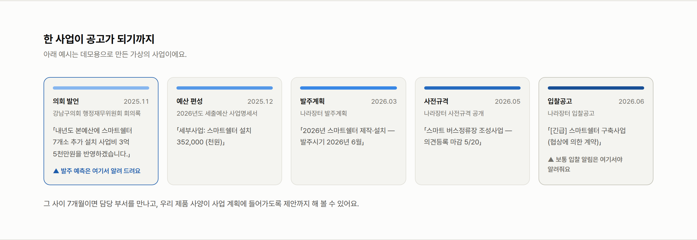
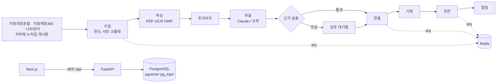
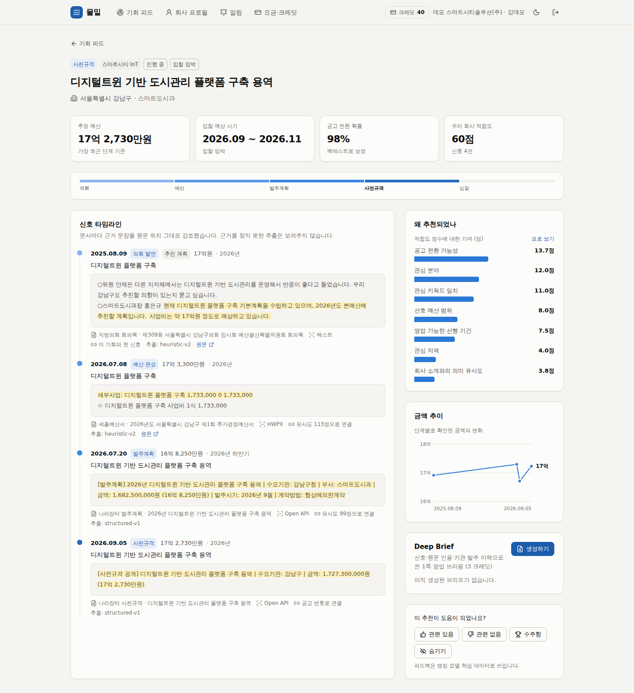
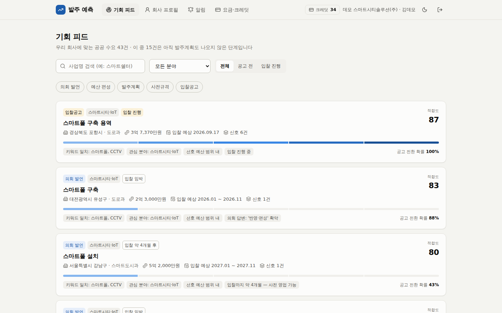
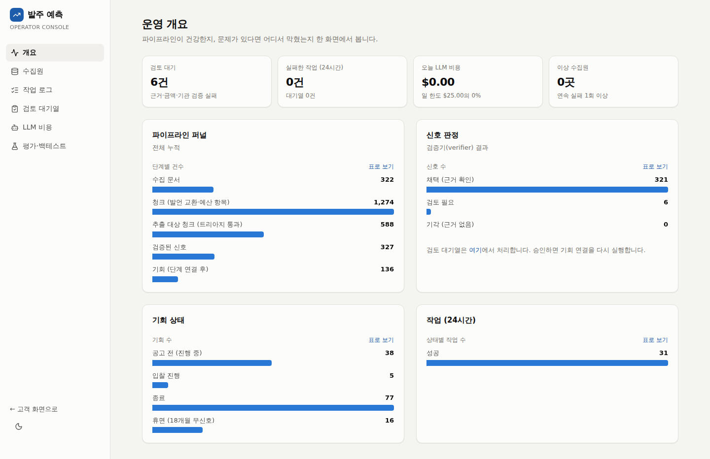
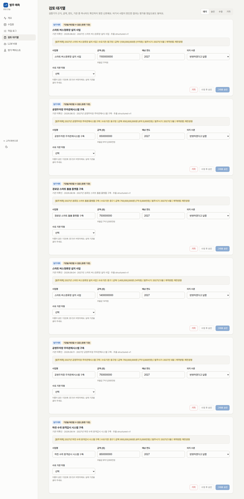
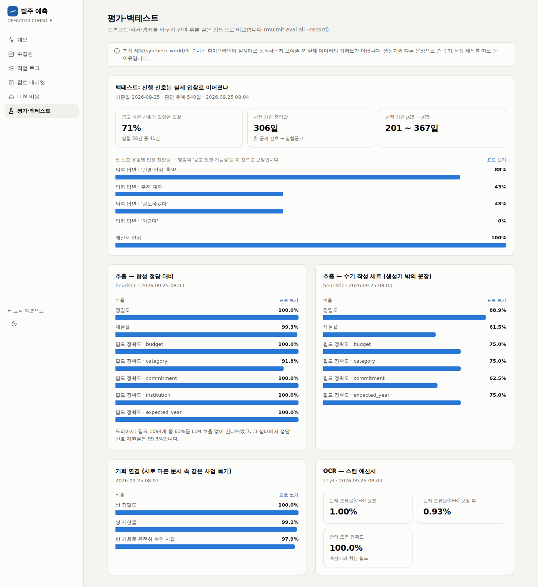
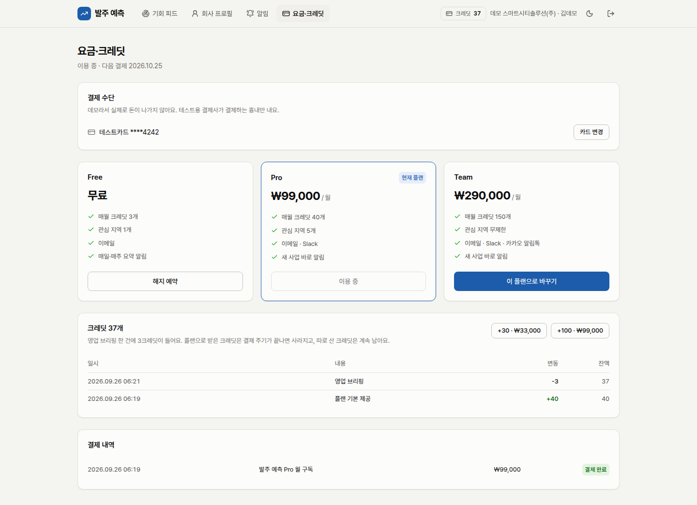
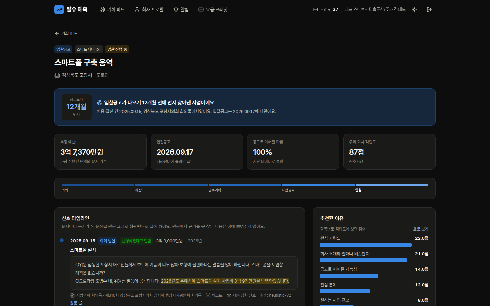

# 발주 예측

**입찰공고 전에 공공사업을 미리 확인하는 공공조달 발주 예측 서비스**

[](https://github.com/sokldjs554/procurement-forecast/actions/workflows/ci.yml)
[](LICENSE)



지자체 사업은 입찰공고 6~18개월 전에 **지방의회 회의록**("내년도 본예산에 반영하겠습니다")과 **세출예산서 세부사업**으로 먼저 모습을 드러냅니다. 발주 예측은 이 문서들을 매일 읽어 수요 신호를 뽑고, 원문 근거를 검증한 뒤, 발주계획 → 사전규격 → 입찰공고로 이어지는 하나의 **기회**로 묶어 공급 기업에 추천합니다.

구조로 보면 **공개 데이터를 매일 수집·구조화해 기업마다 맞춤 추천하고 알리는 B2B SaaS**입니다: 수집(공공 API·누리집 크롤링) → 추출·검증(LLM + 원문 대조) → 추천 → 알림 → 구독·크레딧 과금.

**30초 둘러보기** — 랜딩에서 한 번 눌러 데모로 들어가, 기회 피드의 정렬과 단계별 건수를 보고, '입찰 진행' 탭에서 입찰공고 12개월 전에 찾아낸 사업을 열어 원문 근거가 칠해진 신호 타임라인을 본 뒤 영업 브리핑을 만듭니다.


<sub>화면과 수치는 모두 합성 데모 데이터입니다(아래 [평가](#평가) 참고). GIF와 스크린샷은 사례가 더 많은 `manage seed --scale 1.5` 세계에서 찍었고(기본 `make demo`는 1.0), LLM 키 없이 규칙 기반 추출기와 템플릿 브리핑으로 돌아갑니다.</sub>

---

## 목차
- [왜 이 주제인가](#왜-이-주제인가)
- [무엇을 하나](#무엇을-하나)
- [채용 공고 항목별 구현 위치](#채용-공고-항목별-구현-위치)
- [아키텍처](#아키텍처)
- [평가](#평가)
- [대용량 쿼리](#대용량-쿼리)
- [화면](#화면)
- [실행하기](#실행하기)
- [저장소 구조](#저장소-구조)
- [한계와 다음 단계](#한계와-다음-단계)

## 왜 이 주제인가

채용 공고는 만들 제품을 "대규모 공개 데이터를 수집·구조화해 기업에 맞춤 추천하는 B2B AI SaaS"라고 소개하고, "매일 도는 수집·추출·추천·알림 파이프라인이 제품의 핵심"이라고 적고 있습니다. 그래서 주제는 두 가지를 기준으로 골랐습니다. 그 파이프라인을 처음부터 끝까지 전부 거쳐야 할 것, 그리고 이미 흔한 주제는 아닐 것. 두 번째를 확인하려고 국내·해외의 비슷한 서비스를 조사했습니다([전체 조사 문서](docs/research/market-landscape.md)).

| | 대표 사례 | 가장 이른 신호 |
|---|---|---|
| 국내 · 정부지원사업 매칭 | 지원매치, 지원금AI, K-Fund, 커넥트웍스 | 지원사업 공고 |
| 국내 · 나라장터 공고 분석 | 클라이원트, 낙비, 디마툴즈, 일타비드, 다수의 GitHub 프로젝트 | 발주계획·사전규격·입찰공고 |
| 국내 · 회의록 AI | 개혁연구원 회의록 DB, 충남도의회 AI 검색 | 회의록 (정책·의정 용도, 영업용 아님) |
| **해외 · 공고 이전 신호** | [Starbridge](https://starbridge.ai/features/buying-signals-monitor), [GovSpend Meeting Intelligence](https://govspend.com/meeting-intelligence/), [Hamlet](https://www.myhamlet.com/about) | **회의록·예산 문서 (RFP 6~18개월 전)** |

- 지원사업 매칭과 공고 검색은 국내에서 이미 포화 상태이고, 같은 공공 API로 만든 포트폴리오도 많습니다.
- 미국에서는 "공고 이전 신호"가 독립된 제품 범주로 투자를 받고 있습니다. 국내에서는 클라이원트 2.0(2025년 9월)이 과거 실적·발주계획·사전규격으로 **이미 나온 적 있는 사업이 언제 다시 나올지**를 예측하는 데까지 와 있고, 회의록·예산서에서 **아직 한 번도 공고되지 않은 신규 사업**을 먼저 찾는 서비스는 찾지 못했습니다.
- 데이터는 열려 있습니다: 국회도서관 지방의정포털 Open API(회의록), 지방재정365(예산서), 조달청 발주계획·사전규격·입찰공고·계약과정통합공개 API.

## 무엇을 하나

```
의회 발언 ──► 예산 편성 ──► 발주계획 ──► 사전규격 ──► 입찰공고
 6~18개월      3~12개월      1~6개월       2~8주         D-day
 회의록         세출예산서     나라장터       나라장터       나라장터
 (HTML)        (PDF·스캔·HWP) (API)         (API)         (API)
```

1. **수집**: 공공 API 다섯 개를 호출 한도·장애를 견디며 증분 수집하고, API가 없는 지자체 누리집 게시판은 robots.txt를 지키는 크롤러로 수집합니다.
2. **파싱**: 스캔 PDF는 페이지 단위 OCR, HWP/HWPX는 직접 파싱, 회의록은 질문–답변 교환 단위로 자릅니다.
3. **추출**: Claude 구조화 출력으로 사업명·금액·연도·발언 강도(확약/계획/검토/어렵다)·근거 문장을 뽑습니다. 키가 없거나 예산을 넘으면 규칙 기반 추출기가 대신합니다.
4. **근거 검증**: 인용 문장이 원문에 있는지, 금액·연도가 원문과 맞는지 코드로 다시 확인합니다. 틀리면 버리거나 운영자 검토로 보냅니다.
5. **연결**: 서로 다른 이름("스쿨존 카메라" ↔ "어린이보호구역 지능형 CCTV" ↔ "스쿨존 AI 안전카메라 설치사업")을 같은 사업으로 묶습니다.
6. **추천·알림**: 회사 프로필 적합도에 공고 전환 가능성과 영업 가능한 선행 기간을 더해 순위를 매기고, 이메일·Slack·카카오 알림톡으로 알립니다.
7. **과금**: 월 구독(토스페이먼츠 자동결제) + 크레딧(영업 브리핑 1회 3크레딧).

## 채용 공고 항목별 구현 위치

공고의 문장을 그대로 옮기고, 각 항목이 이 저장소 어디에 있는지 적었습니다.

### 주요업무

| 공고 | 이 저장소에서 | 위치 |
|---|---|---|
| FastAPI 기반 비동기 API 서버의 기능 개발과 운영 (데이터 수집·추출·추천·알림·결제 도메인 전반) | 앱 팩토리, async SQLAlchemy, 키셋 페이지네이션, 요청 ID·구조화 로그, 과금 API의 `Idempotency-Key`. 수집·추출·추천·알림·결제 라우터 전부 | [`api/`](apps/api/src/app/api) |
| 작업 큐(Redis)와 cron 잡 위에서 도는 대용량 배치 파이프라인 설계·개선 | arq 워커 + KST cron(매시 조달, 매일 회의록, 매주 예산서, 10분 스윕, 아침 요약), 작업 ID 중복 제거, 한도 초과·서킷·일시 오류별 재시도, 종료 신호 시 재시도로 기록, 실행 이력 `job_runs` | [`worker/`](apps/api/src/app/worker), [ADR-0003](docs/adr/0003-arq-and-in-worker-cron.md) |
| PostgreSQL 스키마 설계와 마이그레이션, 대용량 데이터 환경에서의 쿼리 최적화 | 24개 테이블, Alembic 비동기 마이그레이션. 공고 10만·신호 40만 건 벤치로 찾은 문제를 마이그레이션 0002로 해결: 벡터 후보 **13건·재현율 4% → 300건·100%**, 참조번호 조회 **120ms → 0.03ms**, 운영 집계 229 → 148ms. 인덱스는 `CONCURRENTLY` | [`migrations/`](apps/api/migrations), [performance.md](docs/performance.md), [ADR-0010](docs/adr/0010-measure-at-volume.md) |
| Next.js·TypeScript 기반 사용자 웹과 운영자 콘솔(admin) 화면 개발 | 고객 앱(피드·기회 상세·프로필·알림·요금) + 운영 콘솔(개요·수집원·작업 로그·검토 대기열·LLM 비용·평가) | [`apps/web`](apps/web) |
| LLM 파이프라인 개선 (프롬프트 설계, 구조화 출력, 결과 검증, 품질 평가, 비용 최적화) | 구조화 출력(엄격 JSON 스키마), 프롬프트 캐싱, effort 조절, 원문 근거 검증기, 합성 정답·수기 세트(54건) 평가, 모델·effort별 정확도·비용·지연 실측(Opus 5 low: 재현율 46% → 100%, 청크당 $0.0107; 측정으로 금액 파서 버그 발견·수정), 트리아지(청크 59% LLM 생략)·해시 캐시·일일 예산 가드 | [`llm/`](apps/api/src/app/llm), [`grounding.py`](apps/api/src/app/domain/grounding.py), [`eval/`](apps/api/src/app/eval), [ADR-0002](docs/adr/0002-grounded-extraction.md), [ADR-0006](docs/adr/0006-one-model-low-effort.md) |
| 비정형 문서 파싱과 OCR 파이프라인 정확도 개선 | PDF 페이지별 텍스트층 판정 → 부족한 페이지만 OCR(tesseract `kor+eng`) + 후보정(문자 오류율 1.13% → 0.99%, 금액 100%), HWP5 레코드 파서, HWPX | [`parsing/`](apps/api/src/app/parsing) |
| 멀티채널 알림 발송(이메일·메신저)과 구독·크레딧 결제 도메인 개발 | 이메일·Slack·카카오 알림톡, 중복 방지·방해 금지 시간. 토스 정기결제(빌링키 암호화, 멱등 결제, 웹훅 대사, 1·3·7일 재시도) + 추가 전용 크레딧 원장 | [`notify/`](apps/api/src/app/notify), [`billing/`](apps/api/src/app/billing), [ADR-0005](docs/adr/0005-credit-ledger.md) |
| 클라우드 컨테이너 서비스 배포·운영과 로깅·에러 트래킹 기반 장애 대응 | Docker 이미지 2개, GCP Cloud Run(API 내부 전용·워커 헬스체크)·Cloud SQL·Memorystore Terraform, 키 없는 배포(WIF), structlog JSON, Sentry, 런북 | [`infra/`](infra/terraform), [배포 워크플로](.github/workflows/deploy.yml), [런북](docs/runbook.md) |
| 명세가 불완전한 요구사항을 구조로 세우고, 결정을 문서로 남기는 일 | ADR 10건(주제 선정부터 크롤러·대용량 인덱스까지), 시장 조사, 아키텍처·데이터 소스·평가·성능 문서 | [`docs/`](docs), [ADR 목록](docs/adr/README.md) |

### 우대사항

| 공고 | 이 저장소에서 | 위치 |
|---|---|---|
| LLM 애플리케이션 개발 경험 (프롬프트 설계, 구조화 출력, 결과 검증, 품질 평가) | 위 LLM 파이프라인 항목과 같음. 평가는 CI 품질 기준으로 강제 | [평가](docs/evaluation.md) |
| 문서 파싱·데이터 수집 경험 (비정형 문서 처리, 대규모 크롤링, 데이터 정규화) | 지자체 누리집 게시판 크롤러(robots.txt, 호스트별 속도, 증분, 크기 상한, 바이트로 형식 판별), 한국어 금액·기관·시점 정규화 | [`crawler.py`](apps/api/src/app/sources/crawler.py), [`domain/`](apps/api/src/app/domain), [ADR-0009](docs/adr/0009-polite-board-crawler.md) |
| OCR 파이프라인 구축 및 정확도 개선 경험 | 페이지 단위 OCR 판정, 이진화 전처리, 금액·조사 위주 후보정, 문자 오류율 측정 | [`ocr.py`](apps/api/src/app/parsing/ocr.py), [`ocr_correct.py`](apps/api/src/app/parsing/ocr_correct.py) |
| 검색·추천·랭킹 시스템 설계 경험 | 벡터 + 트라이그램 + 분야로 후보 생성, 7개 특징 가중 랭킹과 추천 이유, 백테스트로 전환율 보정, 문서 간 기회 연결 | [`recommend.py`](apps/api/src/app/pipeline/recommend.py), [`link.py`](apps/api/src/app/pipeline/link.py) |
| 결제·구독 시스템 연동 경험 (정기결제, 크레딧) | 토스페이먼츠 빌링 연동, 동시 사용에도 음수가 될 수 없는 크레딧 원장 | [`billing/`](apps/api/src/app/billing) |
| AI 코딩 에이전트를 실제 개발 워크플로우에 녹여 본 경험 | 에이전트 지침, 평가 수치로 끝나는 작업 루프, 사람이 확인할 항목 명시 | [`AGENTS.md`](AGENTS.md), [AI 워크플로](docs/ai-workflow.md) |
| 대규모 외부 공개 데이터를 다뤄 본 경험 | 국회도서관 지방의정포털, 조달청 나라장터 3종, 지방재정365, 지자체 누리집 | [데이터 소스](docs/data-sources.md) |

<details>
<summary><b>자격요건</b> (Backend · Frontend · Infra/운영 · 공통)</summary>

| 공고 | 이 저장소에서 |
|---|---|
| Python 비동기 기반 API 서버 개발·운영 경험 (FastAPI 또는 동급 프레임워크) | FastAPI + async SQLAlchemy + asyncpg, 워커까지 전부 asyncio |
| PostgreSQL 스키마 설계, 마이그레이션, 쿼리 최적화 경험 | 위 주요업무 3번 |
| 작업 큐 / 스케줄러 기반 배치·크론잡 설계 및 운영 경험 | arq + cron, 작업 로그와 운영 콘솔 재실행 |
| 외부 API 연동 시 timeout·재시도·폴백을 스스로 설계해 본 경험 | 공공 API: 지터 백오프, `Retry-After`, HTTP 200 오류 본문 분류, 서킷 브레이커, 일일 한도. LLM: 서버 측 fallback → 규칙 기반 추출기 |
| TypeScript 실무 경험 (엄격한 타입 환경) | `strict` + `noUncheckedIndexedAccess`, OpenAPI에서 생성한 API 타입 |
| Next.js·React 기반 웹 애플리케이션 개발 경험 | Next.js 16 App Router, React 19 |
| 서버 상태 관리 및 API 연동 경험 | TanStack Query + openapi-fetch, BFF 프록시 |
| 컴포넌트 시스템 기반 UI 구현 경험 | 디자인 토큰(라이트/다크) 위의 UI 컴포넌트, 차트 라이브러리 없는 SVG 차트 |
| 클라우드(GCP 또는 AWS) 컨테이너 서비스 배포·운영 경험 | GCP Cloud Run Terraform, 배포 워크플로 |
| Docker 기반 개발 환경 구성 경험 | `docker compose up`으로 DB·Redis·메일·API·워커·웹 |
| 로깅·에러 트래킹 기반 장애 대응 경험 | structlog JSON(요청·작업 ID), Sentry, 워커 헬스체크, 런북 |
| Git 브랜치 전략과 코드 리뷰 기반 협업 경험 | 짧은 브랜치 + 트렁크, squash merge, Conventional Commits, PR 템플릿, CODEOWNERS. PR 예: [#6](https://github.com/sokldjs554/procurement-forecast/pull/6) 의존성 PR 검토(액션 10개 호환성 대조), [#7](https://github.com/sokldjs554/procurement-forecast/pull/7) 기능 PR(코드 리뷰 15건 중 13건 반영, 2건은 이유 답변). 초기 구축은 main 직접 커밋 ([CONTRIBUTING](CONTRIBUTING.md)) |
| 테스트 작성 및 정적 타입 검사를 습관으로 갖춘 분 | pytest 134개(실제 PostgreSQL·Redis), vitest 13개, mypy strict, CI 필수 통과 |
| 명세가 불완전한 상태에서 구조를 세우고 문서로 남길 수 있는 능력 | 주요업무 9번 |

</details>

<details>
<summary><b>이런 분과 함께하고 싶습니다</b></summary>

| 공고 | 이 저장소에서 |
|---|---|
| 지저분한 외부 데이터를 끈질기게 다루는 분. 이 제품의 난이도는 대부분 여기에 있습니다 | HWP·스캔 PDF, 천원 단위 표, 동명 기관("중구"), HTTP 200으로 오는 오류, 로그인 페이지가 `.pdf`로 오는 게시판, 규칙 기반 추출기의 제목·분류 오류 개선 기록 |
| 동작하는 코드보다 안정적으로 재현되는 코드를 우선하는 판단 기준을 가진 분 | 시드 고정 합성 세계, CI 품질 기준, 멱등 키, 대용량 벤치 + 회귀 테스트(수정 코드를 빼면 실패함을 확인) |
| 백엔드·프론트엔드·인프라의 경계를 넘나드는 데 거부감이 없는 분 | 백엔드·웹·Terraform·CI를 한 저장소에서 |
| 작은 팀에서 스스로 문제를 정의하고 끝까지 굴려 본 경험이 있는 분 | 시장 조사 → 주제 결정(ADR-0001) → 구현 → 평가 → 운영 문서까지 |

</details>

## 아키텍처



자세한 흐름·도메인 모델·규칙은 [docs/architecture.md](docs/architecture.md), 결정 배경은 [ADR](docs/adr/README.md).

## 평가

정답을 심은 **합성 세계**(시드 7, 기준일 2026-09-25, 규모 1.0; 21개 사업 원형, 동명 기관, 스캔 예산서, 약한 발언, 공고로 이어지지 않는 사업, 무관한 공고 포함)와 생성기 밖의 **수기 세트**, 그리고 **백테스트**로 측정합니다. 추출은 이 저장소 기본값인 **규칙 기반 추출기**로 측정했습니다. CI는 합성 세계 지표에 품질 게이트를 겁니다.

| 영역 | 지표 | 값 |
|---|---|---|
| 추출 (합성) | 정밀도 / 재현율 | 100% / 100% (정답 106건) |
| | 필드 정확도: 금액·연도·발언 강도·기관 / 분야 | 100% / 97.2% |
| 트리아지 | LLM 없이 건너뛴 청크 / 그 상태의 정답 재현율 | 59.4% / 99.1% |
| 연결 | 쌍 정밀도 / 재현율 | 100% / 100% |
| OCR (스캔 예산서) | 문자 오류율 원본 → 보정 / 금액 토큰 정확도 | 1.13% → 0.99% / 100% |
| **수기 세트** (54건, 신호 없는 사례 10건) | 정밀도 / 재현율 (규칙 기반) | **92.0% / 46.0%** |
| 백테스트 | 공고 이전에 공개 신호가 있던 입찰 | 48건 중 75% |
| | 첫 공개 신호 → 입찰공고 선행 기간 중앙값 | 308일 |
| | 의회 발언 강도별 입찰 전환율: 확약 / 검토 | 88.2% / 20.0% |

- 합성 세계 점수는 **파이프라인이 설계대로 동작한다는 증거일 뿐 실제 정확도가 아닙니다.** 같은 사람이 만든 생성기와 추출기는 같은 가정을 공유합니다. 수기 세트의 재현율 46.0%가 규칙 기반 추출기의 실제 한계에 더 가깝고, LLM 경로가 메워야 할 간격입니다.
- 전체 리포트: [docs/evaluation.md](docs/evaluation.md) (`make eval`로 재생성).

### Claude 실측 (수기 세트 54건)

같은 수기 세트를 실제 Claude API로 돌린 결과입니다([LLM eval #3](https://github.com/sokldjs554/procurement-forecast/actions/runs/36158136197), 전체 표: [docs/evaluation-llm.md](docs/evaluation-llm.md)). 점수는 원문 근거 검증기를 거쳐 **저장되는 값** 기준입니다.

측정 방법: `make eval-llm`이 수기 세트를 추출기마다 돌려 정확도, 검증기가 버리거나 고친 신호 수, 비용, 지연을 기록합니다. `--dry-run` 추정은 출력 토큰을 넉넉히 잡아 약 5달러로 나오지만 실제 한 실행은 $1.65였고, `--max-usd`를 넘으면 호출을 멈춥니다. GitHub Actions의 **LLM eval** 워크플로(수동 실행, 저장소 시크릿 `ANTHROPIC_API_KEY`)로 돌리면 결과가 `eval/llm-<실행 번호>.<시도>` 브랜치로 올라와 PR로 검토합니다.

| 추출기 | 정밀도 | 재현율 | 금액 | 연도 | 발언 강도 | 분야 | 청크당 비용 | 지연 p50 |
|---|---:|---:|---:|---:|---:|---:|---:|---:|
| 규칙 기반 | 92.0% | 46.0% | 78.3% | 91.3% | 82.6% | 82.6% | $0 | – |
| **Opus 5 · low (기본값)** | **100%** | **100%** | **100%** | 98.0% | 98.0% | 86.0% | $0.0107 | 4.5초 |
| Opus 5 · medium | 100% | 100% | 100% | 98.0% | 98.0% | 90.0% | $0.0110 | 4.7초 |
| Sonnet 5 · low | 100% | 98.0% | 100% | 98.0% | 98.0% | 87.8% | $0.0042 | 3.6초 |
| Haiku 4.5 | 100% | 92.0% | 100% | 97.8% | 91.3% | 76.1% | $0.0046 | 3.4초 |

- **측정이 버그를 찾았습니다.** 첫 실행([LLM eval #2](https://github.com/sokldjs554/procurement-forecast/actions/runs/36156552633))에서 "2억 8천 정도"를 Claude는 모두 2억 8천만 원으로 맞혔는데, 금액 파서가 200,008,000으로 읽어 검증기가 맞는 답을 틀린 값으로 덮어썼습니다(저장 금액 정확도 98%). 파서를 고치고([#10](https://github.com/sokldjs554/procurement-forecast/pull/10)) 다시 돌려 100%가 됐고, 규칙 기반 추출기의 금액 정확도도 73.9% → 78.3%로 올랐습니다.
- **effort는 low 유지**: medium은 비용만 조금 늘고 나아진 필드가 없습니다. 분야 정확도는 같은 설정으로 다시 돌리면 2~6%p 달라졌습니다(실행 #2 → #3: Opus low 88 → 86%, Opus medium 86 → 90%, Haiku 82 → 76%, [#2 보고서](https://github.com/sokldjs554/procurement-forecast/blob/eval/llm-2.1/docs/evaluation-llm.md)). 그래서 50건 규모에서 1~2건 차이는 우열로 읽지 않습니다.
- **더 싼 모델**: Sonnet 5 low는 비용 39%에 재현율이 1건 낮습니다(r35: 무인 대출기 추가 요청에 구청이 "당분간 계획이 없다"고 한 거절 발언, 두 실행 모두). Haiku 4.5는 토큰 단가가 싸지만 시스템 프롬프트(약 1,400토큰)가 Haiku의 캐시 최소 길이(4,096토큰)보다 짧아 캐시가 전혀 안 걸려(Opus·Sonnet은 입력의 92%가 캐시 읽기) Sonnet보다 비쌉니다. 선택 기준은 [ADR-0006](docs/adr/0006-one-model-low-effort.md).
- **가장 약한 필드는 분야 분류**입니다. 틀린 사례 대부분이 "AI 민원상담 챗봇 → AI·데이터(정답: 공공 SW)"처럼 용도가 아니라 기술 단어로 분류한 경우입니다. 같은 세트로 프롬프트를 고치면 이 세트에만 맞추게 되므로, 새 사례를 따로 모은 뒤 고칩니다.
- 수기 세트는 이 저장소에서 직접 작성한 문장이라 실제 회의록의 분포와 다릅니다. 두 번 실행한 비용은 합계 $3.30입니다.

## 대용량 쿼리

데모 데이터는 수백 행이라 모든 쿼리가 순차 스캔이고, 인덱스 설계의 문제가 보이지 않습니다. `make bench`가 공고 10만·신호 40만·청크 60만·추천 30만 건을 만들어 핫 쿼리를 최초 스키마와 현재 스키마에서 비교합니다.

| 쿼리 | 전 | 후 |
|---|---|---|
| 추천 후보: 가까운 진행 중 공고 300건 (벡터) | **13건만 반환, 재현율 4%** | 300건, 재현율 100% (4.5ms) |
| 기회 연결: 처음 보는 발주계획번호 조회 | 120ms (신호 전체 스캔) | 0.03ms (GIN) |
| 추천 후보: 키워드 | 인덱스 못 씀 (`= ANY`) | 트라이그램 + GIN BitmapOr |
| 운영 개요 집계 | 229ms (청크 2회 스캔) | 148ms |
| 고객 피드: 정렬 3종(잘 맞는 순·입찰이 가까운 순·새 소식 순), 단계별 건수 | — | 각 0.5ms 이하 (회사당 추천 150건) |

첫 줄은 속도가 아니라 **정확성** 문제입니다. 전체 테이블 HNSW 인덱스에 상태 조건을 붙이면 pgvector가 `ef_search`(40)건을 찾은 뒤 필터를 적용해 결과가 조용히 줄어듭니다. 부분 인덱스 + `ef_search` 조정으로 고쳤고, 이 경로를 강제한 회귀 테스트가 있습니다. 전체 결과와 실행 계획: [docs/performance.md](docs/performance.md), 결정: [ADR-0010](docs/adr/0010-measure-at-volume.md).

## 화면

**기회 상세** — 의회 발언부터 입찰공고까지 이어진 신호 6건, 원문 근거 강조, 추천 이유, 금액 추이, 영업 브리핑



| 기회 피드 | 운영 개요 |
|---|---|
|  |  |
| **검토 대기열** — 동명 기관("중구청")을 추측하지 않고 사람에게 넘김 | **평가·백테스트** |
|  |  |
| **요금·크레딧** — 구독, 크레딧 원장, 결제 내역 | **다크 모드** |
|  |  |

그 밖에: [랜딩](docs/screenshots/landing.png) · [회사 프로필](docs/screenshots/profile.png) · [알림 설정](docs/screenshots/alerts.png) · [수집원](docs/screenshots/admin-sources.png) · [작업 로그](docs/screenshots/admin-jobs.png) · [LLM 비용](docs/screenshots/admin-llm.png) · [모바일](docs/screenshots/feed-mobile.png)

<sub>스크린샷은 사례가 더 많은 `manage seed --scale 1.5` 데모 세계에서 찍었습니다.</sub>

## 실행하기

### Docker로 전체 스택

```bash
cp .env.example .env            # 비워 둬도 오프라인 데모가 동작합니다
docker compose up -d --build    # 웹 :3000, API :8000/docs, 메일 확인 :8025
docker compose run --rm api manage seed --anchor 2026-09-25
docker compose run --rm api manage demo run
```

### 로컬 개발

필요: Python 3.11 + [uv](https://docs.astral.sh/uv/), Node 22 + pnpm, Docker(데이터베이스용), tesseract-ocr + `kor` 언어팩(스캔 PDF 데모용).

```bash
make install        # uv sync + pnpm install
make infra          # PostgreSQL(pgvector)·Redis·Mailpit
make demo           # 마이그레이션 → 합성 세계 시드 → 전체 파이프라인 → 아침 요약 메일 발송 (Mailpit :8025에서 확인, 약 20초)
make api            # :8000   (다른 터미널)
make worker         # arq 워커 + cron
make web            # :3000
make lint test eval
make bench         # 대용량 쿼리 실행 계획 비교 (몇 분)
make eval-llm      # Claude 모델·effort 비교 (API 키 필요, 약 5달러)
make check-sources # 조달청 API 실호출 점검 (공공데이터포털 키 필요, DB 불필요)
```

### 데모 계정

| 계정 | 비밀번호 | 역할 |
|---|---|---|
| `demo@example.com` | `demo-pass-1234` | Pro 플랜, 스마트쉘터·스마트폴·지능형 CCTV 기업 |
| `care@example.com` | `demo-pass-1234` | 무료 플랜, AI 돌봄 스피커 스타트업 |
| `admin@example.com` | `admin-pass-1234` | 운영 콘솔(`/admin`) |

### 실제 키로 켜기

`.env`에 넣으면 해당 부분만 실제 서비스로 바뀝니다: `APP_ANTHROPIC_API_KEY` + `APP_LLM_PROVIDER=anthropic`, `APP_VOYAGE_API_KEY`, `APP_CLIK_API_KEY`, `APP_DATA_GO_KR_SERVICE_KEY`, `APP_LOFIN_API_KEY`, 토스(`APP_PAYMENT_PROVIDER=toss`), Solapi. 전체 목록은 [.env.example](.env.example).

## 저장소 구조

```
apps/api/             FastAPI · arq 워커 · 파이프라인 (Python 3.11, uv)
  src/app/
    sources/          공공 API 어댑터, 누리집 게시판 크롤러, 한도·서킷·재시도
    parsing/          PDF 텍스트층, OCR(+후보정), HWP5/HWPX, 청크
    llm/              Claude 제공자, 규칙 기반 추출기, 캐시·예산 가드
    domain/           금액·기관·시점 정규화, 근거 검증, 분류, 동의어
    pipeline/         수집 → 처리 → 연결 → 추천 → 브리프, 백테스트
    billing/ notify/  토스 자동결제·크레딧 원장 / 이메일·Slack·알림톡
    api/ worker/      HTTP 라우터 / arq 작업·cron
    demo/ eval/       합성 세계·합성 누리집 / 평가 러너·수기 세트
    bench.py          대용량 쿼리 벤치 (manage bench)
  migrations/ tests/
apps/web/             Next.js 16 고객 앱 + 운영 콘솔
infra/terraform/      GCP 서울 리전 (Cloud Run, Cloud SQL, Memorystore, …)
docs/                 조사, ADR, 아키텍처, 평가, 데이터 소스, 런북, 스크린샷
```

## 한계와 다음 단계

솔직하게 적습니다.

- **실데이터로 확인한 건 조달청 API뿐입니다.** 활용신청을 마친 키로 2026-09-26에 `make check-sources`를 돌려, 9개 오퍼레이션(발주계획·사전규격·입찰공고 × 용역·물품·공사)이 모두 응답하고 받은 항목이 전부 레코드로 변환되는 걸 확인했습니다. 이 점검에서 버그 두 개가 나왔습니다. 발주계획은 필수 파라미터가 빠지면 HTTP 200에 오류 본문을 돌려주는데 이걸 "0건 성공"으로 읽고 있었고, 공사 입찰공고는 예산을 다른 필드(`bdgtAmt`)로 줘서 금액이 부가세 빠진 추정가격으로 들어가고 있었습니다([#19](https://github.com/sokldjs554/procurement-forecast/pull/19), [점검 결과](docs/data-sources.md)). 국회도서관 지방의정포털(회의록)·지방재정365(예산서)·기관 누리집은 아직 호출해 보지 못해, 공개 명세와 계약 픽스처, 합성 누리집으로만 검증했습니다. 이쪽에서 필드명이 어긋나면 설정(`sources.config`)으로 코드 수정 없이 고칩니다.
- **Claude 품질은 수기 세트 54건으로만 측정했습니다.** 재현율 100%·금액 100%는 직접 작성한 문장 기준이고, 실제 회의록 분포에서는 낮아질 수 있습니다. 실데이터가 들어오면 검토 대기열의 판정을 정답 세트로 쌓아 다시 잽니다.
- **대용량 벤치는 합성 데이터입니다.** 주제별로 뭉친 벡터와 균등한 기관 분포는 실제와 다릅니다. 실데이터가 쌓이면 `pg_stat_statements` 상위 쿼리로 다시 측정해야 합니다.
- **인프라는 검증까지만 했습니다.** Terraform은 `validate`를 통과했고 CI가 이미지를 빌드하지만, 실제 GCP 프로젝트에 적용하지는 않았습니다.
- **법·약관 검토 필요**: 공공누리 유형, 회의록 발언자 실명 표시 범위, 자동결제 약관.
- 다음 후보: 검토 대기열 판정을 정답 세트로 축적, 예산서 표 구조 인식 개선, 기관별 발주 이력 기반 전환율 모델, 담당 부서 연락처 연결.

## 라이선스

[Apache License 2.0](LICENSE)
