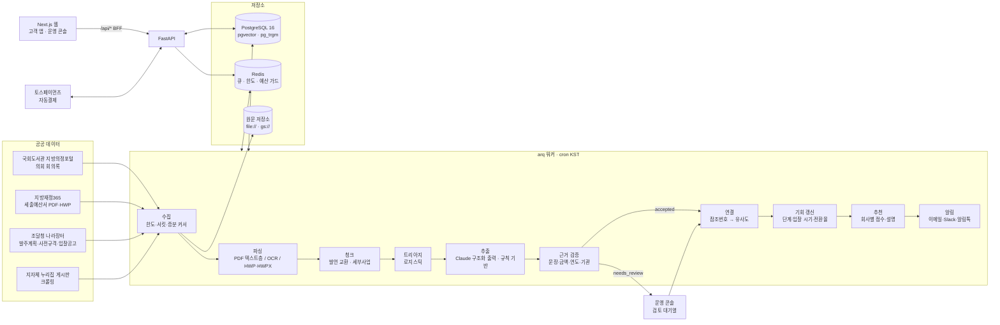
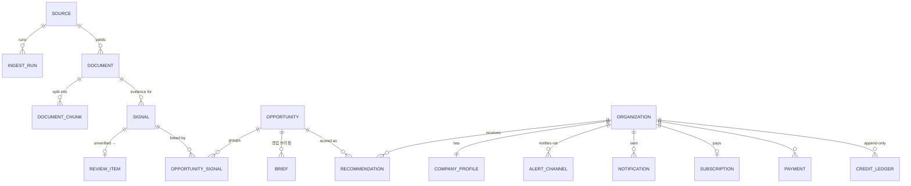

# 아키텍처

## 한눈에

## 도메인 모델

- **Document**: 원문 한 건(회의록 1회분, 예산서 1권, 조달 레코드 1건). 내용 해시로 중복 제거, 원문 바이트는 콘텐츠 주소 저장소.
- **Signal**: 문서에서 추출한 "수요의 흔적" 하나. 단계(`council_mention`/`budget_line`/`order_plan`/`prespec`/`bid_notice`), 금액, 예상 연도·반기, 발언 강도(`committed`/`planned`/`reviewing`/`declined`), 근거 문장 오프셋, 검증 결과(`grounding`), 추출기 ID(모델·프롬프트 버전).
- **Opportunity**: 같은 사업으로 판단된 신호의 묶음. 현재 단계, 추정 예산(가장 최근 단계 기준), 입찰 예상 구간, 공고 전환 확률, 상태(`open`/`bid_open`/`closed`/`dormant`).
- **Recommendation**: 회사 × 기회 점수와 특징별 기여(`breakdown`), 사용자 피드백.

## 처리 단계의 핵심 규칙

| 단계 | 규칙 | 코드 |
|---|---|---|
| 수집 | 토큰 버킷 + KST 일일 한도(Redis Lua), 서킷 브레이커, data.go.kr의 HTTP 200 오류 본문 분류, 7일 창 분할·페이지네이션, 증분 커서. API가 없는 누리집 게시판은 robots.txt를 지키는 크롤러로 수집 | `sources/` |
| 파싱 | PDF 페이지별 텍스트층 품질 검사 → 부족하면 그 페이지만 300dpi 렌더링 후 tesseract `kor+eng`(Otsu 이진화), 금액·조사 위주의 OCR 후보정. HWP5는 레코드 파서(PARA_TEXT), HWPX는 XML | `parsing/` |
| 청크 | 회의록은 질문–답변 교환 단위, 예산서는 세부사업 블록 단위, 표 머리의 `(단위: 천원)` 기억 | `parsing/chunking.py` |
| 트리아지 | 조달 동사·분야 키워드·발언 강도·금액·미래 시점·잡음(절차 발언) 특징의 로지스틱 점수 < 0.35면 LLM 호출 생략 | `pipeline/triage.py` |
| 추출 | Claude structured outputs(엄격 JSON 스키마) → 실패·예산 초과·거부 시 규칙 기반 추출기, 모든 호출을 `llm_calls`에 기록 | `llm/` |
| 검증 | 근거 문장 위치, 금액 재파싱, 연도 재해석, 기관 확인 → `accepted`/`needs_review`/`rejected` | `domain/grounding.py` |
| 연결 | 발주계획번호·사전규격번호·공고번호가 있으면 그대로 연결. 없으면 같은 수요기관의 후보 중 `0.35·의미 + 0.30·제목 + 0.15·분야 + 0.10·예산 + 0.10·시간` 최고점 ≥ 0.60이면 연결, 서로 다른 구체 사업명(스마트쉘터 vs 스마트폴)은 −0.15, 유일한 동종·동규모 후보는 가산 | `pipeline/link.py` |
| 기회 갱신 | 단계 = 도달한 최고 단계, 입찰 예상 구간 = 단계별 경험적 지연, 전환 확률 = 첫 신호 유형별 백테스트 전환율 | `pipeline/link.py`, `pipeline/backtest.py` |
| 추천 | 후보 = pgvector 근접 + 제목 trigram + 관심 분야. 점수 = `0.26·의미 + 0.22·키워드 + 0.12·분야 + 0.08·지역 + 0.08·예산 + 0.14·전환 + 0.10·선행기간`, 제외 키워드는 강한 감점 | `pipeline/recommend.py` |
| 알림 | 새 기회·단계 상승만, 중복 키로 1회, KST 방해 금지 시간, 일시 오류 재시도 / 영구 오류(폐기된 웹훅 등) 채널 비활성화 | `notify/` |
| 과금 | 추가 전용 크레딧 원장, 멱등 키, 토스 빌링키(Fernet 암호화), 갱신 실패 1·3·7일 재시도 | `billing/` |

## 배포 형태

- 이미지 두 개: `apps/api`(API·워커·마이그레이션 공용, tesseract 포함), `apps/web`(Next.js standalone).
- 로컬: `docker-compose.yml`(PostgreSQL+pgvector, Redis, Mailpit, API, 워커, 웹).
- 프로덕션(GCP 서울): Cloud Run(web 공개, api 내부 전용, worker CPU 상시 1대), 마이그레이션 Cloud Run Job, Cloud SQL, Memorystore, Secret Manager, GCS, Artifact Registry. Terraform: [`infra/terraform`](../infra/terraform/README.md).
- CI: ruff·mypy strict·pytest(실제 PostgreSQL/Redis 서비스 컨테이너)·OpenAPI 드리프트·데모 파이프라인·평가 품질 게이트·웹 typecheck/lint/test/build·Terraform validate·Docker 빌드. 배포: 태그 → WIF 인증 → 이미지 푸시 → 마이그레이션 Job → 롤아웃 → 스모크 테스트.

## 대용량에서의 쿼리

`manage bench`가 공고 10만·신호 40만 건 규모에서 핫 쿼리의 실행 계획을 최초 스키마와 비교합니다. 그 측정으로 찾은 문제(벡터 검색 결과 누락, 참조번호 전체 스캔 등)와 인덱스 결정은 [ADR-0010](adr/0010-measure-at-volume.md), 수치는 [performance.md](performance.md).

## 관측

- **로그**: structlog JSON(요청 ID, 작업 ID, 시도 횟수 바인딩). Cloud Logging이 그대로 파싱.
- **오류 추적**: Sentry(FastAPI·arq 통합, 개인정보·키 제거 스크러버), 웹은 `NEXT_PUBLIC_SENTRY_DSN`이 있을 때만 브라우저 SDK.
- **운영 콘솔**: 파이프라인 퍼널, 수집원별 마지막 실행·서킷 상태, 작업 로그(재실행), 검토 대기열, LLM 비용(일·작업·모델·프롬프트 버전, 캐시 적중·강등 비율), 평가·백테스트 이력.
